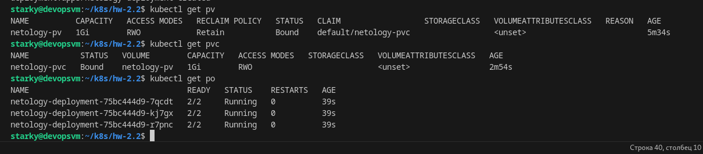
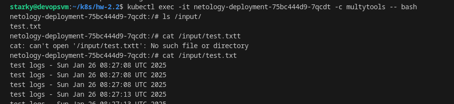
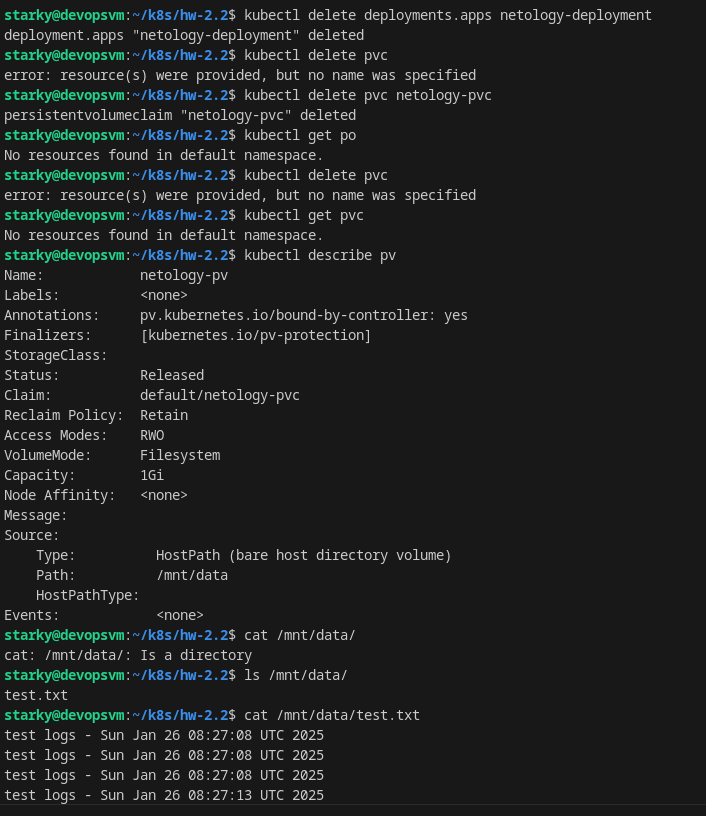
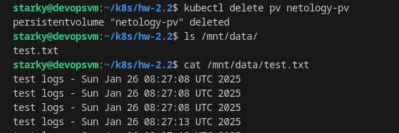
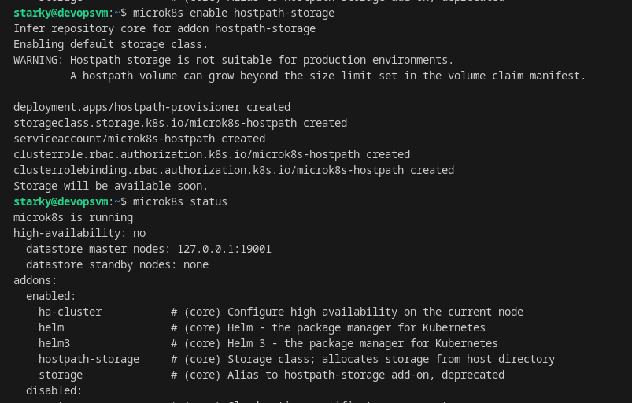
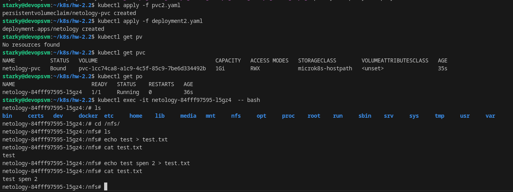

# Домашнее задание к занятию «Хранение в K8s. Часть 2»

### Задание 1

**Что нужно сделать**

Создать Deployment приложения, использующего локальный PV, созданный вручную.

1. Создать Deployment приложения, состоящего из контейнеров busybox и multitool.
2. Создать PV и PVC для подключения папки на локальной ноде, которая будет использована в поде.
3. Продемонстрировать, что multitool может читать файл, в который busybox пишет каждые пять секунд в общей директории. 
4. Удалить Deployment и PVC. Продемонстрировать, что после этого произошло с PV. Пояснить, почему.
5. Продемонстрировать, что файл сохранился на локальном диске ноды. Удалить PV.  Продемонстрировать что произошло с файлом после удаления PV. Пояснить, почему.
6. Предоставить манифесты, а также скриншоты или вывод необходимых команд.
------
### Решение 
* 1,2: 
* 
* 3:
* 
* 4,5:
* 
* 
* При удалении Deployment и PVC PV остался на месте, так как он не зависит от Deployment и PVC. При удалении же самого PV файл остался на месте т.к. в данном случаи спользуется локальное хранилище
------
### Задание 2

**Что нужно сделать**

Создать Deployment приложения, которое может хранить файлы на NFS с динамическим созданием PV.

1. Включить и настроить NFS-сервер на MicroK8S.
2. Создать Deployment приложения состоящего из multitool, и подключить к нему PV, созданный автоматически на сервере NFS.
3. Продемонстрировать возможность чтения и записи файла изнутри пода. 
4. Предоставить манифесты, а также скриншоты или вывод необходимых команд.
------
### Решение
* 
* 
------