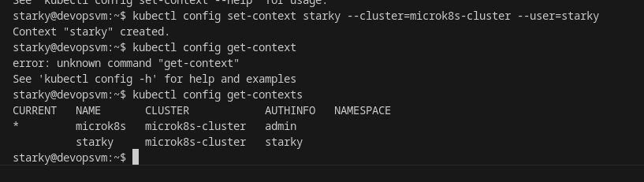

# Домашнее задание к занятию «Управление доступом»
### Цель задания
 В тестовой среде Kubernetes нужно предоставить ограниченный доступ пользователю.
------
### Задание 1. Создайте конфигурацию для подключения пользователя
1. Создайте и подпишите SSL-сертификат для подключения к кластеру.
2. Настройте конфигурационный файл kubectl для подключения.
3. Создайте роли и все необходимые настройки для пользователя.
4. Предусмотрите права пользователя. Пользователь может просматривать логи подов и их конфигурацию (`kubectl logs pod <pod_id>`, `kubectl describe pod <pod_id>`).
5. Предоставьте манифесты и скриншоты и/или вывод необходимых команд.
------
### Решение:
* 
* 
* 
* 
* 
* 
* 
* 